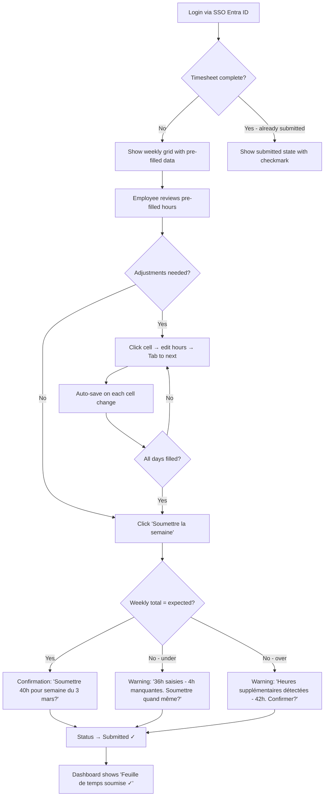
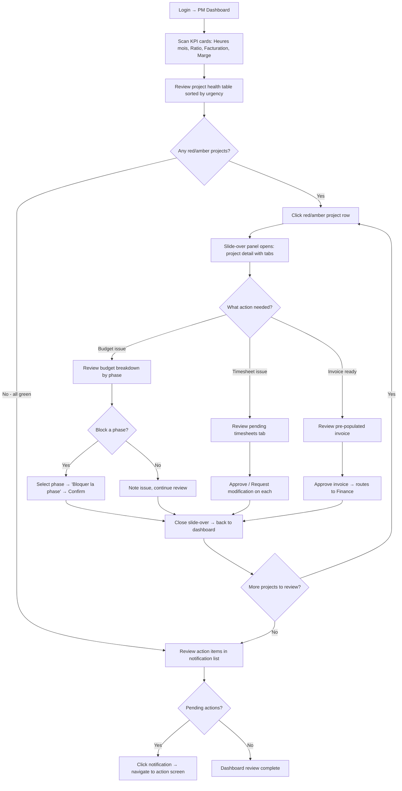
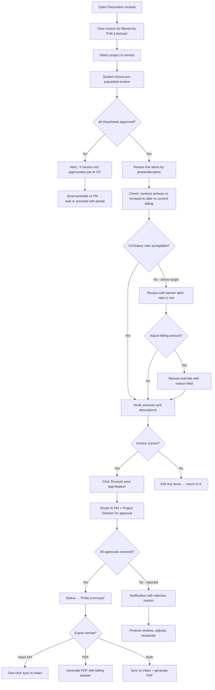
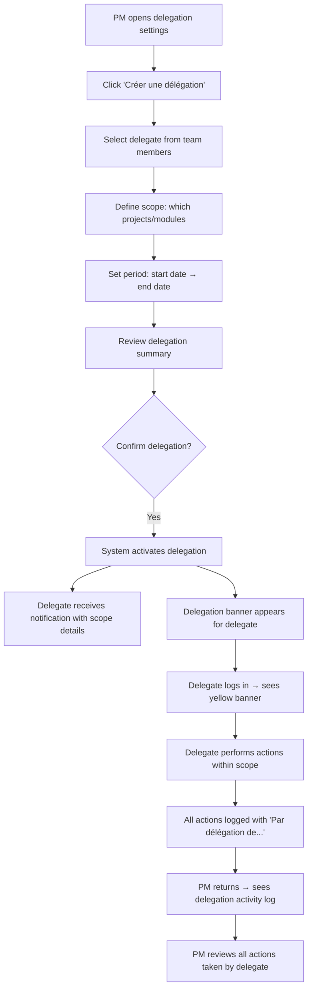
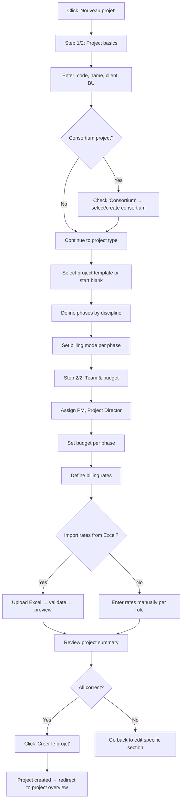

# UX Design Specification ERP

**Author:** Philippe
**Date:** 2026-03-04

---

<!-- UX design content will be appended sequentially through collaborative workflow steps -->

## Executive Summary

### Project Vision

An ERP platform purpose-built for architecture firms, designed by architects who understand the unique workflows of the profession. The product replaces fragmented tools (Excel, legacy ERPs, manual processes) with a unified, intuitive system that covers the full project lifecycle — from proposal creation through time tracking, billing, and financial reporting.

Three pillars define the UX vision:
1. **Simplicity first** — Everything in one tool, with minimal clicks and cognitive load. Architects and PMs should spend time designing buildings, not fighting software.
2. **Maturity meets AI** — Intelligent assistance for repetitive tasks (timesheet reminders, invoice anomaly detection, budget forecasting) without replacing human judgment.
3. **Built by architects, for architects** — Domain-specific workflows (phases by discipline, consortium management, virtual profiles, multi-rate billing) that generic ERPs cannot provide.

### Target Users

| Role | Profile | Primary Goals | Tech Savviness | Usage Context |
|------|---------|---------------|----------------|---------------|
| **Employee** (Marie) | Architect/Engineer, 25-45 yrs | Quick daily time entry, expense reports | Medium | Desktop & tablet, office/site |
| **Project Manager** (Jean-François) | Senior architect, 35-55 yrs | Project creation, resource allocation, budget tracking, invoice preparation | Medium-High | Desktop, office |
| **Project Director** | Partner/Associate, 45-60 yrs | Financial oversight, invoice approval, BU alignment | Medium | Desktop, occasional mobile |
| **Dept. Assistant** | Administrative staff, 30-50 yrs | Clerical tasks for PMs, delegated invoicing | Medium | Desktop, office |
| **Finance/Controller** (Nathalie) | Accountant/Controller, 30-55 yrs | Billing, revenue recognition, Intact API sync, consortium tracking | High | Desktop, office |
| **Associate/BU Director** (Pierre) | Firm partner, 45-65 yrs | Dashboard KPIs, profitability analysis, strategic decisions | Low-Medium | Desktop & mobile, meetings |
| **Admin** | IT/Operations, 30-50 yrs | System config, user management, integrations | High | Desktop |

Key user insight: Most users (employees, PMs) are **not finance people** — they need financial concepts presented in project terms (hours, phases, deliverables), not accounting terms (GL codes, journal entries).

### Key Design Challenges

1. **Complexity vs. Simplicity paradox** — The system manages 7+ modules with 78 functional requirements, yet must feel simple for an architect doing daily time entry. The UX must create clear information layers: simple surface for routine tasks, progressive disclosure for power users.

2. **Multi-role, multi-permission interactions** — 7 distinct roles with delegation capabilities create complex permission scenarios. The UI must gracefully handle role-based visibility without creating confusion (e.g., an employee who is also a PM on one project and a regular contributor on another).

3. **Dual financial views for consortiums** — Consortium projects require showing both Provencher's internal view AND the consortium-wide view with partner contributions, profit-sharing ratios, and shared billing — without overwhelming the PM who just needs to manage their team's hours.

4. **Data density for financial dashboards** — BU Directors and Finance need information-rich dashboards (profitability ratios, WIP, outstanding invoices, budget burn rates) that remain scannable at a glance. The mockups show table-heavy screens that need careful visual hierarchy.

5. **Delegation and context switching** — Users acting as delegates must clearly understand when they're operating on someone else's behalf. The system must prevent accidental actions in the wrong context while keeping the delegation workflow frictionless.

### Design Opportunities

1. **Intelligent time entry** — Auto-suggest projects/phases based on recent activity, calendar integration, and resource allocation. The Party Mode discussions revealed that employees often forget to fill timesheets — proactive reminders and "quick fill from last week" patterns can dramatically improve adoption.

2. **Guided project creation wizard** — The mockups show a two-step project creation flow. This can be enhanced with smart defaults (copying settings from similar past projects), inline validation, and contextual help that reduces PM training time to near-zero.

3. **Visual budget health indicators** — Replace pure numbers with intuitive visual cues (progress bars, traffic-light indicators, trend arrows) that let PMs and Directors instantly spot projects that need attention. The OOTI UX analysis confirms this pattern is highly effective in architecture ERPs.

4. **Unified notification center with actionable items** — Consolidate pending approvals, overdue timesheets, invoice milestones, and delegation requests into a single prioritized feed. Each notification leads directly to the action screen — one click from alert to resolution.

5. **Consortium visualization** — A unique differentiator: visual representation of consortium structure (members, projects, profit-sharing flows) that no competitor offers. This transforms a complex financial concept into an intuitive project management tool.

## Core User Experience

### Defining Experience

The ERP's core experience revolves around a **daily rhythm**: employees enter time, PMs monitor project health, Finance processes billing, Directors make strategic decisions. Every role feeds into a single data flow where time entry is the foundational input.

**Core user action: Time entry.** It is the most frequent interaction (every employee, every day) and the data foundation for everything downstream — billing, profitability, dashboards, consortium tracking. If time entry is fast and accurate, the entire system works. If it fails, nothing else matters.

**Critical action to get right: Project financial health at a glance.** PMs and Directors must instantly see budget consumption, profitability trends, and anomalies without digging through tables. The Party Mode discussions confirmed that current tools (Excel, legacy ERP) force PMs to compile data manually — the defining experience is eliminating that friction entirely.

**The core loop:**
1. Employee enters time (< 2 min/day)
2. System calculates project health in real-time
3. PM reviews dashboard, takes corrective action if needed
4. Finance prepares pre-populated invoices
5. Director sees BU-level KPIs without asking anyone

### Platform Strategy

| Dimension | Decision | Rationale |
|-----------|----------|-----------|
| **Primary platform** | Web application (desktop-first) | Office-based work, complex data tables, multi-panel layouts |
| **Secondary platform** | Responsive tablet | Site visits for time entry, meeting room dashboard reviews |
| **Tertiary platform** | Mobile-responsive views | Directors checking KPIs before meetings, timesheet reminders |
| **Input mode** | Mouse/keyboard primary, touch secondary | Data-heavy input (timesheets, invoices) requires keyboard efficiency |
| **Offline** | Not required for MVP | Office environment with reliable connectivity; deferred to Phase 2 |
| **Browser targets** | Chrome, Edge, Safari (latest 2 versions) | Microsoft 365 ecosystem (Edge) + macOS common in architecture firms |
| **Accessibility** | WCAG 2.1 AA compliance | Government project requirements, inclusive design |

**Key platform constraint:** The mockups demonstrate table-heavy screens (timesheets, invoice preparation, resource allocation). The design system must ensure these remain usable on 13" laptop screens — the most common device in architecture firms.

### Effortless Interactions

These interactions must feel **invisible** — zero friction, zero thinking:

1. **Daily time entry** — Pre-filled from last week's pattern or resource allocation. Employee confirms or adjusts. Target: under 2 minutes per day, achievable in 3-5 clicks. Auto-save on every cell change (no "Save" button).

2. **Project status check** — PM opens dashboard, instantly sees which projects are on track (green), at risk (amber), or over budget (red). No clicks needed to understand the situation. Visual budget bars replace raw numbers.

3. **Invoice preparation** — System pre-populates invoice from approved timesheets, rates, and billing rules. Finance reviews and adjusts rather than building from scratch. One-click export to Intact API format.

4. **Delegation activation** — PM going on vacation selects delegate, defines scope and period, done. Delegate sees a clear banner indicating they're acting on behalf of someone. One-click to return to own context.

5. **Consortium view toggle** — Simple toggle between "My firm's view" and "Consortium view" on any project screen. No navigation change, just data perspective shift.

6. **Smart notifications** — "3 timesheets pending your approval" with direct link. "Project X budget at 85%" with link to details. No notification noise — only actionable items.

### Critical Success Moments

**Make-or-break moments** that determine if users adopt or reject the system:

1. **First time entry (Day 1)** — An employee opens the timesheet screen for the first time. Without any training, they must understand: which projects are theirs, how to enter hours, and how to submit. If this takes more than 3 minutes, adoption is at risk. *Design response: pre-assigned projects visible, clear grid layout matching the mockup pattern, inline guidance on first use only.*

2. **PM's first "aha" moment** — A PM opens their dashboard and sees, for the first time, all their projects' financial health in one view — something that previously required hours of Excel compilation. This moment must feel like a revelation, not a data overload. *Design response: visual hierarchy with summary cards at top, detail tables below, traffic-light indicators.*

3. **First billing cycle** — Finance processes the first month's invoices. The system must demonstrate its value by having pre-calculated amounts, auto-matched timesheets, and clear approval workflows. If Finance has to re-enter data, trust is lost. *Design response: pre-populated invoice drafts, clear approval status tracking, one-click Intact export.*

4. **Director's board meeting prep** — A BU Director opens the mobile view 10 minutes before a meeting. They need portfolio-level KPIs (profitability by project, outstanding receivables, resource utilization) in a scannable format. *Design response: executive summary cards with trend indicators, expandable for detail, optimized for mobile viewport.*

5. **Delegation handoff** — A PM delegates to a colleague before vacation. The delegate must feel confident about what they can and cannot do, and the returning PM must see a clear audit trail of actions taken. *Design response: explicit scope confirmation screen, delegation banner, activity log.*

### Experience Principles

Five guiding principles for every UX decision in this product:

| # | Principle | Meaning | Test |
|---|-----------|---------|------|
| 1 | **Two-Minute Rule** | Any routine task completes in under 2 minutes | Time the core tasks — if any exceeds 2 min, redesign the flow |
| 2 | **Glanceable Health** | Key information visible without clicks or scrolling | Can a PM assess project health in < 5 seconds from the dashboard? |
| 3 | **Smart Defaults, Easy Overrides** | System suggests based on patterns; user corrects with minimal effort | Are defaults right > 80% of the time? Is override always < 2 clicks? |
| 4 | **Role-Appropriate Simplicity** | Each role sees only what they need, nothing more | Does an employee ever see a GL code? Does a Director see individual timesheets? |
| 5 | **Zero-Training for Basics** | Core tasks (time entry, status check) require no training | Can a new employee fill their first timesheet without help? |

## Desired Emotional Response

### Primary Emotional Goals

| Emotional Goal | Description | Why It Matters |
|----------------|-------------|----------------|
| **Confidence** | "I know exactly where my project stands" | PMs and Directors currently piece together data from multiple sources. The ERP must eliminate uncertainty and give users trust in the numbers they see. |
| **Efficiency** | "That was fast — I'm done already" | Architects resent administrative tools that steal time from design work. Every interaction must feel quick and purposeful. |
| **Trust** | "These numbers are right, I don't need to double-check" | Finance and PMs currently validate ERP data against Excel. The system must earn trust through transparency and accuracy. |
| **Ownership** | "This is MY tool, built for MY profession" | Generic ERPs feel foreign to architects. This product must feel like it speaks their language — phases, disciplines, deliverables — not accounting jargon. |

### Emotional Journey Mapping

| Stage | Desired Emotion | Design Response |
|-------|----------------|-----------------|
| **Discovery** (first demo) | Recognition — "This was made for us" | Use architecture-specific vocabulary in UI. Show project phases, not GL codes. Dashboard resembles how architects think about projects. |
| **Onboarding** (first week) | Confidence — "I can do this without help" | Zero-training design for core tasks. Contextual onboarding tips that disappear after first use. No mandatory training sessions. |
| **Daily use** (time entry) | Flow — "Done before I even thought about it" | Pre-filled timesheets, auto-save, keyboard navigation. The interaction should feel automatic, like checking email. |
| **Weekly review** (PM dashboard) | Clarity — "I see the full picture instantly" | Visual health indicators, summary-first layout, drill-down on demand. No information overload on first glance. |
| **Monthly billing** (Finance) | Relief — "Everything was already prepared" | Pre-populated invoices, automated matching, clear approval workflows. Billing day should feel routine, not stressful. |
| **Error/problem** | Safety — "I can fix this, nothing is lost" | Undo capability, clear error messages with resolution paths, no irreversible actions without explicit confirmation. Audit trail provides safety net. |
| **Returning** (next day) | Anticipation — "Let me check my dashboard" | Persistent state, personalized landing page, relevant notifications. The system remembers where the user left off. |

### Micro-Emotions

**Critical micro-emotions to cultivate:**

1. **Confidence over Confusion** — Every screen must answer "What am I looking at?" and "What should I do next?" within 3 seconds. Clear labels, consistent patterns, visible breadcrumbs. No dead-end screens.

2. **Trust over Skepticism** — Show data sources. When displaying a profitability ratio, let the user click to see the calculation. When pre-filling an invoice, show which timesheets contributed. Transparency builds trust faster than accuracy alone.

3. **Accomplishment over Frustration** — Celebrate completed tasks subtly (checkmarks, progress indicators, "all timesheets submitted" state). Make progress visible. A PM who completes their weekly review should feel a sense of closure.

4. **Calm over Anxiety** — Users must never fear making mistakes. Draft states, undo options, and clear "this will..." confirmation dialogs eliminate the anxiety of clicking the wrong button. Validated timesheets can be corrected by Finance — nothing is permanently locked.

5. **Focus over Distraction** — Notifications are helpful, not noisy. The system surfaces what needs attention without creating a sense of urgency for non-urgent items. Priority-based notification design prevents alert fatigue.

### Design Implications

| Emotion | UX Design Approach |
|---------|-------------------|
| **Confidence** | Consistent layout patterns across all modules. Same position for actions, same visual language for status. Users learn the system once, apply everywhere. |
| **Efficiency** | Keyboard shortcuts for power users. Tab-navigation through timesheet cells. Bulk actions for approvals. "Quick actions" menu accessible from any screen. |
| **Trust** | Clickable calculations — every number can be expanded to show its source data. Audit trail visible to appropriate roles. Data freshness indicators ("Updated 2 min ago"). |
| **Ownership** | Architecture-specific terminology throughout. Project phases named by discipline (Architecture, Structure, MEP), not generic "Phase 1, 2, 3". Customizable dashboard widgets. |
| **Safety** | Draft → Submitted → Approved workflow with clear state indicators. Undo available for 30 seconds after actions. Confirmation modals for financial actions (invoice approval, phase blocking). |
| **Focus** | Clean, uncluttered interface with generous whitespace. Progressive disclosure — summary view by default, detail on demand. Role-based navigation that hides irrelevant modules entirely. |

### Emotional Design Principles

| # | Principle | Application |
|---|-----------|-------------|
| 1 | **Show, don't tell** | Use visual indicators (colors, icons, progress bars) instead of text-heavy status descriptions. A green bar communicates health faster than "Project is within budget parameters." |
| 2 | **Reward routine** | Make daily tasks satisfying through micro-feedback: auto-save confirmation, completion indicators, streak recognition for consistent time entry. |
| 3 | **Transparent calculations** | Every computed value is expandable. Users build trust by verifying once, then trusting forever. Never show a number without a path to its origin. |
| 4 | **Graceful errors** | Errors are opportunities to help, not punish. "This timesheet overlaps with approved hours on Project X — would you like to adjust?" instead of "Error: duplicate entry." |
| 5 | **Respect expertise** | Users are professionals. Don't over-explain, don't block with unnecessary confirmations, don't infantilize. Progressive disclosure lets experts move fast while supporting newcomers. |

## UX Pattern Analysis & Inspiration

### Inspiring Products Analysis

#### 1. OOTI (Architecture ERP — Direct Domain Reference)

OOTI is the closest competitor in the architecture ERP space. Our OOTI UX analysis document provides detailed insights:

| Strength | What They Do Well | Lesson for Our Product |
|----------|-------------------|----------------------|
| **Domain vocabulary** | Uses architecture-specific terms (phases, disciplines, deliverables) natively | Adopt fully — our users should never see generic ERP terminology |
| **Project dashboard** | Clean summary cards with budget/hours/profitability at a glance | Adopt the card-based summary pattern, enhance with our traffic-light system |
| **Time entry grid** | Weekly grid view with project rows and day columns | Adopt as base pattern — matches our mockup approach. Add auto-fill and keyboard navigation |
| **Role-based views** | Different dashboards per role | Adopt — aligns with our "Role-Appropriate Simplicity" principle |

| Weakness | What They Do Poorly | How We Improve |
|----------|---------------------|----------------|
| **Complex navigation** | Deep menu hierarchy, features hard to discover | Flat sidebar navigation with search. Max 2 clicks to any screen |
| **No consortium support** | Cannot manage multi-firm projects | Our unique differentiator — visual consortium management |
| **Rigid workflows** | Limited customization of approval flows | Configurable workflows with delegation system |
| **Poor mobile experience** | Desktop-only design, not responsive | Mobile-responsive from Day 1 for dashboards and time entry |

#### 2. Harvest (Time Tracking — Interaction Excellence)

Harvest is the gold standard for time entry UX, used across creative industries:

| Pattern | Why It Works | Application |
|---------|-------------|-------------|
| **One-click timer** | Start/stop with a single click, project auto-selected | Adapt for our timesheet — quick-add row with project search |
| **Weekly overview** | Visual weekly summary with daily totals | Adopt — our mockup already uses this pattern. Enhance with budget context |
| **Gentle reminders** | Non-intrusive email/Slack reminders for missing time | Adopt — configurable reminders (email, in-app notification, Teams integration) |
| **Visual reports** | Clean charts for time distribution by project/person | Adapt for PM dashboard — budget burn charts, utilization visualizations |

#### 3. Linear (Project Management — Speed & Polish)

Linear sets the standard for fast, keyboard-first professional tools:

| Pattern | Why It Works | Application |
|---------|-------------|-------------|
| **Keyboard-first** | Every action accessible via keyboard shortcuts, command palette (Cmd+K) | Adopt — critical for power users (PMs, Finance). Command palette for quick navigation |
| **Instant feedback** | Optimistic UI updates, no loading spinners for common actions | Adopt — auto-save timesheets, instant status updates, optimistic rendering |
| **Clean density** | High information density without feeling cluttered | Adapt — our data-heavy tables need this balance. Generous row height, clear column separation |
| **Contextual actions** | Right-click and hover menus reveal actions only when relevant | Adopt — table row actions appear on hover, keeping the default view clean |

#### 4. Stripe Dashboard (Financial Data — Clarity & Trust)

Stripe excels at presenting complex financial data clearly:

| Pattern | Why It Works | Application |
|---------|-------------|-------------|
| **Summary → Detail drill-down** | Top-level metrics with expandable detail | Adopt — PM and Director dashboards: KPI cards → click → detail tables |
| **Transparent calculations** | Every amount is clickable, showing contributing transactions | Adopt — aligns with our "Trust" emotional principle. Profitability shows source hours/rates |
| **Real-time data indicators** | "Updated 2 min ago" badges, live status dots | Adopt — critical for financial trust. Show data freshness on dashboards |
| **Export-friendly tables** | One-click CSV/PDF export from any data view | Adopt — Finance needs Excel exports, Directors need PDF reports |

### Transferable UX Patterns

#### Navigation Patterns

| Pattern | Source | Application in ERP |
|---------|--------|-------------------|
| **Collapsible sidebar** | Notion, Linear | Main navigation with module groups. Collapsed = icons only for more workspace. Persists user preference. |
| **Command palette (Cmd+K)** | Linear, VS Code | Quick jump to any screen, project, or action. Search across all entities. Power user accelerator. |
| **Breadcrumb trail** | Stripe | Always visible path: Dashboard > Project X > Phase 2 > Timesheets. Click any level to navigate back. |
| **Tab-based sub-navigation** | Google Workspace | Within a project: Overview \| Timesheets \| Budget \| Invoices \| Team. No page reload, instant switching. |

#### Interaction Patterns

| Pattern | Source | Application in ERP |
|---------|--------|-------------------|
| **Inline editing** | Airtable, Google Sheets | Timesheet cells, budget amounts, project attributes — click to edit, Tab to next, auto-save. |
| **Drag-and-drop** | Monday.com | Resource allocation: drag team members onto project timeline. Phase reordering. |
| **Bulk actions** | Gmail | Select multiple timesheets/invoices → Approve all, Reject selected, Export batch. |
| **Smart search with filters** | Jira, Linear | Search projects by name, PM, status, BU. Saved filters for recurring queries. |
| **Optimistic updates** | Linear | UI updates immediately on action, syncs in background. Undo available if sync fails. |

#### Visual Patterns

| Pattern | Source | Application in ERP |
|---------|--------|-------------------|
| **Traffic-light status** | Jira, Monday.com | Green/Amber/Red for project health, budget status, timeline adherence. Universally understood. |
| **Progress bars with context** | GitHub | Budget consumption: "65% used, 45% of timeline elapsed" — shows burn rate intuitively. |
| **Sparkline trends** | Stripe | Small inline charts showing profitability trend over last 6 months. No click needed. |
| **Avatar stacks** | GitHub, Slack | Team members shown as overlapping avatars on project cards. Visual team composition at a glance. |
| **Empty states with guidance** | Stripe, Linear | "No invoices this month" with clear CTA: "Create first invoice" or "Import from timesheets." |

### Anti-Patterns to Avoid

| Anti-Pattern | Why It Fails | Our Alternative |
|-------------|-------------|-----------------|
| **SAP-style form overload** | Dozens of required fields per screen. Users avoid the system entirely. | Progressive disclosure: show essential fields, reveal advanced options on demand. Max 7 visible fields per form section. |
| **Modal cascade** | Modal opens another modal opens a confirmation. Users lose context. | Maximum 1 modal deep. Use slide-over panels for secondary content. Inline editing where possible. |
| **Hidden navigation** | Hamburger menus, deeply nested submenus. Users can't find features. | Always-visible sidebar. Flat hierarchy: max 2 levels. Command palette as safety net. |
| **Dashboard overload** | 20+ widgets on a single dashboard. Nothing stands out. | Role-specific dashboards with 4-6 focused widgets. Customizable but curated defaults. |
| **Confirmation fatigue** | "Are you sure?" on every action. Users click "Yes" reflexively. | Only confirm destructive/financial actions. Use undo for reversible actions. Draft states eliminate most confirmations. |
| **Notification spam** | Email for every system event. Users disable all notifications. | Smart defaults: only actionable items. User-configurable per notification type. Digest mode available. |
| **Inconsistent vocabulary** | "Project" in one screen, "Job" in another, "Engagement" in a third. | Single terminology glossary enforced across all screens. Architecture-specific terms only. |

### Design Inspiration Strategy

**What to Adopt Directly:**
- Harvest-style weekly timesheet grid with auto-fill (core interaction)
- Linear-style command palette and keyboard shortcuts (power user efficiency)
- Stripe-style transparent calculations and drill-down (trust building)
- Traffic-light status indicators across all modules (universal understanding)
- Collapsible sidebar navigation with module grouping (spatial consistency)

**What to Adapt for Our Context:**
- OOTI's role-based dashboards — enhance with our delegation system awareness and consortium toggle
- Linear's optimistic UI — apply selectively to non-financial actions (timesheets yes, invoice approval needs server confirmation)
- Airtable's inline editing — adapt for timesheet grid with architecture-specific constraints (phase assignments, billable/non-billable rules)
- Stripe's export capabilities — add Intact API format alongside CSV/PDF

**What to Avoid Entirely:**
- SAP/Oracle-style form complexity — our users are architects, not data entry clerks
- Modal cascades — one modal maximum, prefer slide-over panels
- Generic ERP terminology — every label must use architecture profession vocabulary
- Permission-denied walls — hide features users can't access rather than showing disabled buttons with cryptic messages

## Design System Foundation

### Design System Choice

**Approach: Themeable System — TailwindCSS + Headless UI + Custom Design Tokens**

The tech stack already specifies TailwindCSS as the styling foundation. Rather than adopting a monolithic component library that would fight against Tailwind's utility-first philosophy, we build a **layered design system**:

| Layer | Technology | Purpose |
|-------|-----------|---------|
| **Styling foundation** | TailwindCSS 3.x | Utility-first CSS, design tokens via `tailwind.config.js`, responsive design, dark mode ready |
| **Interactive primitives** | Headless UI (Vue) | Accessible, unstyled components (modals, dropdowns, tabs, combobox) — we control the look, they handle a11y |
| **Data components** | TanStack Table (Vue) | High-performance data tables for timesheets, invoices, budgets — virtual scrolling, sorting, filtering, inline editing |
| **Charts & visualizations** | Chart.js + vue-chartjs | Dashboard KPI charts, budget burn visualizations, sparklines, profitability trends |
| **Form handling** | VeeValidate + Zod | Type-safe form validation matching Django REST Framework serializer rules |
| **Custom components** | Project component library | Architecture-specific components built on top of the above layers |

### Rationale for Selection

| Factor | Decision Rationale |
|--------|-------------------|
| **Tech stack alignment** | TailwindCSS is already specified in the project config. Headless UI is made by the Tailwind team — seamless integration. |
| **Customization freedom** | Architecture firms need a professional, domain-specific look — not Material Design or Ant Design's generic aesthetic. Headless components let us fully control visual identity. |
| **Data table requirements** | Timesheets, invoice lists, resource allocation, and budget tables are the core of this ERP. TanStack Table provides virtual scrolling for large datasets, inline editing, and keyboard navigation — critical for our "Two-Minute Rule" principle. |
| **Accessibility** | Headless UI handles ARIA attributes, keyboard navigation, and focus management out of the box. WCAG 2.1 AA compliance without manual implementation. |
| **Bundle size** | Headless UI + TanStack Table are tree-shakeable. Only imported components are bundled. No 500KB+ monolithic library. |
| **Team velocity** | Small team can build custom components faster with Tailwind utilities than learning a complex component library's theming API. Copy-paste from Tailwind UI templates accelerates development. |
| **Vue 3 + TypeScript** | All selected libraries have first-class Vue 3 and TypeScript support. Full type safety from data layer to UI. |

### Implementation Approach

#### Design Tokens (tailwind.config.js)

The design system is configured through Tailwind's design token system:

**Color palette:**
- `primary` — Brand color for actions, links, active states (architecture firm blue)
- `success/warning/danger` — Traffic-light system for project health indicators
- `neutral` — Gray scale for text, borders, backgrounds
- `surface` — Background layers (page, card, modal, tooltip)

**Typography scale:**
- Dashboard headings: `text-2xl font-semibold` (project names, KPI values)
- Table headers: `text-sm font-medium uppercase tracking-wide` (column labels)
- Body text: `text-sm` (table cells, form labels, descriptions)
- Small text: `text-xs` (timestamps, secondary info, helper text)

**Spacing system:**
- Consistent 4px grid: `space-1` (4px) through `space-16` (64px)
- Card padding: `p-4` (16px) standard, `p-6` (24px) for dashboard cards
- Table row height: `h-10` (40px) for comfortable click targets on dense data

**Breakpoints:**
- `sm` (640px): Mobile — simplified layouts, stacked cards
- `md` (768px): Tablet — timesheet entry, basic dashboards
- `lg` (1024px): Laptop — full application layout with sidebar
- `xl` (1280px): Desktop — expanded data tables, multi-panel views

#### Component Library Structure

```
src/components/
├── ui/                    # Base design system components
│   ├── Button.vue         # Primary, secondary, ghost, danger variants
│   ├── Badge.vue          # Status badges (draft, submitted, approved)
│   ├── Card.vue           # Dashboard cards, summary cards
│   ├── Modal.vue          # Confirmation dialogs, detail views
│   ├── SlideOver.vue      # Side panels for contextual info
│   ├── Tabs.vue           # Sub-navigation within screens
│   ├── Table.vue          # Wrapper around TanStack Table
│   ├── DataGrid.vue       # Inline-editable grid (timesheets)
│   ├── StatusIndicator.vue # Traffic-light dots and progress bars
│   ├── CommandPalette.vue  # Cmd+K quick navigation
│   └── ...
├── domain/                # Architecture ERP-specific components
│   ├── ProjectCard.vue    # Project summary with health indicators
│   ├── TimesheetGrid.vue  # Weekly time entry grid
│   ├── BudgetBar.vue      # Visual budget consumption bar
│   ├── ApprovalFlow.vue   # Draft → Submitted → Approved visual
│   ├── DelegationBanner.vue # "Acting on behalf of..." indicator
│   ├── ConsortiumToggle.vue # Firm view ↔ Consortium view switch
│   └── ...
└── layout/                # Application layout components
    ├── Sidebar.vue        # Collapsible navigation sidebar
    ├── TopBar.vue         # Search, notifications, user menu
    ├── PageHeader.vue     # Breadcrumbs + page title + actions
    └── ...
```

### Customization Strategy

**Brand identity approach:**
- Professional, clean aesthetic inspired by architecture firm sensibilities — minimal decoration, strong typography, generous whitespace
- Color palette derived from Provencher_Roy brand guidelines (to be provided)
- No rounded corners on data components (tables, grids) — sharp edges for precision feel
- Subtle rounded corners on interactive elements (buttons, cards, badges) — approachable but professional

**Component customization rules:**
1. **Never modify Headless UI internals** — style through Tailwind classes only
2. **TanStack Table styling via Tailwind** — cell renderers use standard Tailwind utilities
3. **Custom components follow Tailwind patterns** — props map to Tailwind class variants
4. **Dark mode from Day 1** — all tokens defined for both light and dark themes via `dark:` prefix
5. **Component documentation** — every custom component documented with Storybook for design-dev alignment

**Responsive strategy:**
- Mobile-first CSS with Tailwind breakpoints
- Sidebar collapses to icons at `lg`, hidden at `md` (hamburger menu)
- Data tables switch to card layout on `sm` screens
- Dashboard cards stack vertically on `md` and below
- Timesheet grid scrolls horizontally on small screens with sticky project column

## Defining Core Interaction

### Defining Experience

**"Open, see, act — in under 10 seconds."**

The defining experience of this ERP is the moment a user opens the application and *immediately knows what needs their attention* — without searching, filtering, or compiling data. The system surfaces the right information to the right role at the right time.

**How users will describe it:**
- Employee: "I open it, my timesheet is already filled from last week, I adjust two cells, done."
- PM: "I see my projects' health instantly — green, amber, red. I click the red one, I know exactly what's wrong."
- Finance: "Invoice day used to take all morning. Now the invoices are pre-built when I arrive."
- Director: "Before a meeting, I check my phone — all my BU's KPIs in one glance."

**The one thing we must get perfectly right:** The transition from "I opened the app" to "I know what to do" must be instantaneous. Zero cognitive load to reach the first useful insight.

### User Mental Model

**How users currently solve this problem:**

| Role | Current Approach | Pain Point | Mental Model |
|------|-----------------|------------|-------------|
| **Employee** | Opens Excel or legacy ERP, finds project codes, types hours manually, saves, emails PM | "Where's the code for that project? Did I submit last Friday?" | Thinks in projects and days, not codes and categories |
| **PM** | Compiles data from 3-4 sources (ERP exports, Excel, email), builds status report manually | "I spend 2 hours every Monday just figuring out where my projects stand" | Thinks in project health (on track / at risk / over budget), not rows and columns |
| **Finance** | Exports timesheets, cross-references rates, manually builds invoices in accounting software | "I re-enter the same data three times across different systems" | Thinks in billing cycles and client accounts, not individual time entries |
| **Director** | Asks PMs for updates, waits for monthly reports, makes decisions on stale data | "By the time I see the numbers, it's too late to act" | Thinks in portfolio health and strategic decisions, not operational details |

**Key mental model insight:** Every role thinks in *outcomes* (project health, billing readiness, strategic KPIs), not *inputs* (hours, rates, codes). The ERP must present information in outcome terms, with input details available on demand.

**Workarounds users have developed:**
- Color-coded Excel sheets to simulate traffic-light project health
- Personal reminder systems for timesheet submission
- Shadow spreadsheets to track "real" project profitability vs. ERP numbers
- Informal hallway conversations to get project status instead of checking the system

The ERP must make all these workarounds unnecessary.

### Success Criteria

**The core interaction succeeds when:**

| Criteria | Measurement | Target |
|----------|-------------|--------|
| **Time to first insight** | Seconds from login to understanding what needs attention | < 5 seconds |
| **Time entry completion** | Minutes to complete a full week's timesheet | < 2 minutes |
| **Decision confidence** | Users trust dashboard data without cross-checking Excel | > 90% of users within 3 months |
| **Action proximity** | Clicks from identifying a problem to taking action on it | ≤ 2 clicks |
| **Return rate** | Users voluntarily check dashboard beyond required tasks | Daily for PMs, weekly for Directors |
| **Workaround elimination** | Shadow spreadsheets abandoned in favor of ERP dashboards | 100% within 6 months |

**Success indicators by role:**

- **Employee feels successful when:** Timesheet is submitted and they're back to their architecture work in under 2 minutes
- **PM feels successful when:** Monday morning dashboard check replaces 2 hours of data compilation
- **Finance feels successful when:** Month-end billing is completed in half the time with zero data re-entry
- **Director feels successful when:** They walk into a meeting with current KPIs they trust, checked 5 minutes ago on their phone

### Novel UX Patterns

**Pattern classification for this ERP:**

This product primarily uses **established patterns combined in innovative ways**. No user education is needed for individual interactions — the innovation is in how they connect.

| Pattern | Classification | Approach |
|---------|---------------|----------|
| **Weekly timesheet grid** | Established (Harvest, OOTI) | Familiar grid pattern. Innovation: AI-powered pre-fill from allocation + last week's pattern. |
| **Dashboard KPI cards** | Established (Stripe, Monday.com) | Standard card layout. Innovation: role-specific curation + real-time data from time entry. |
| **Traffic-light status** | Established (universal) | Green/amber/red dots. Innovation: calculated from live project data, not manually set. |
| **Command palette** | Established (Linear, VS Code) | Cmd+K quick navigation. Innovation: context-aware suggestions based on user's current tasks and role. |
| **Consortium toggle** | **Novel** | No existing pattern. A simple toggle that shifts the entire screen's data perspective between firm view and consortium view while maintaining layout. Requires careful design. |
| **Delegation banner** | **Semi-novel** | Similar to "viewing as" in admin tools, but applied to a full ERP context with scoped permissions. Needs clear visual treatment to prevent confusion. |
| **Transparent calculations** | Semi-novel (Stripe-inspired) | Click any number to see its breakdown. Innovation: applied to architecture-specific metrics (profitability by phase, cost by discipline). |

**Teaching strategy for novel patterns:**
- **Consortium toggle:** First-time tooltip: "Switch between your firm's view and the full consortium view." Subtle animation on toggle to show data transformation.
- **Delegation banner:** First-time modal explaining delegation scope. Persistent top banner with delegate name and "Exit delegation" button always visible.

### Experience Mechanics

#### 1. Employee Time Entry Flow

**Initiation:**
- User logs in → lands on personal dashboard with "Timesheet" as primary action
- If timesheet is incomplete, a gentle prompt: "You have 3 days to fill this week"
- One click to open weekly timesheet view

**Interaction:**
- Grid pre-filled from resource allocation + last week's pattern
- User clicks a cell → types hours → Tab to next cell (auto-save)
- Project search via typing in empty row — fuzzy match, recent projects first
- Billable/non-billable indicator visible per phase (set by PM, not employee)

**Feedback:**
- Daily total updates in real-time as cells are edited
- Weekly total shows progress bar: "32/40 hours entered"
- Cell turns green on auto-save (subtle, 500ms fade)
- Validation: red border + tooltip if hours exceed daily max or conflict with another project

**Completion:**
- "Submit week" button enabled when all days have entries
- Confirmation: "Submit 40 hours for week of March 3?" → Submit
- Status changes to "Submitted" with timestamp
- Dashboard updates: "Timesheet submitted ✓" replaces the prompt

#### 2. PM Dashboard Review Flow

**Initiation:**
- PM logs in → lands on PM dashboard (role-based landing page)
- Sees 4-6 project cards sorted by urgency (red first, then amber, then green)
- "3 items need your attention" notification badge

**Interaction:**
- Scans project cards: each shows name, health indicator, budget bar, hours bar, next milestone
- Clicks a red project card → slide-over panel shows detail: budget breakdown by phase, recent timesheet submissions, outstanding invoices
- From the panel: "Block phase" / "Send reminder" / "View full project" — direct actions

**Feedback:**
- Health indicators update in real-time as timesheets are submitted
- Budget bar shows consumed vs. total with percentage
- Trend arrow (↑↓→) shows direction vs. last month
- Sparkline shows 6-month profitability trend inline

**Completion:**
- PM has reviewed all flagged projects and taken actions
- Dashboard returns to "all green" state (aspiration)
- Action log records what was reviewed and decided

#### 3. Finance Invoice Preparation Flow

**Initiation:**
- Finance opens "Billing" module → sees list of projects ready for invoicing
- Each row shows: project name, period, calculated amount, approval status, PM name
- Filter by: ready to invoice / draft / awaiting approval / sent

**Interaction:**
- Click a project → invoice detail screen with pre-populated data
- All approved timesheets for the period are automatically matched to billing rates
- Line items generated from phase/discipline breakdown
- Finance reviews, adjusts if needed (manual override with reason field)
- "Send for approval" → routes to PM + Project Director (if required)

**Feedback:**
- Calculated amount shows breakdown: "120h × $85/h = $10,200" — clickable to see individual timesheets
- Discrepancy alerts: "3 hours not yet approved by PM" with link to pending timesheets
- Approval workflow visual: Draft → PM Approved → Director Approved → Ready to Send
- Intact API export status: "Ready to sync" / "Synced on March 3"

**Completion:**
- Invoice approved by all required parties
- One-click export to Intact API format
- Invoice status updates to "Sent" with date
- Dashboard reflects: outstanding receivables updated, billing progress bar advances

## Visual Design Foundation

### Color System

**Brand color strategy:** The final primary color will be derived from Provencher_Roy brand guidelines. The system below uses a professional blue as placeholder, easily swapped via Tailwind design tokens.

#### Semantic Color Palette

| Token | Role | Light Mode | Dark Mode | Usage |
|-------|------|-----------|-----------|-------|
| `primary-50` to `primary-900` | Brand identity | Blue scale (9 shades) | Inverted luminance | Active states, links, selected items, primary buttons |
| `neutral-50` to `neutral-900` | Content & structure | Cool gray scale | Warm gray scale | Text, borders, backgrounds, dividers |
| `success-50` to `success-600` | Positive state | Green scale | Adjusted green | Project on track, approved timesheets, completed actions |
| `warning-50` to `warning-600` | Caution state | Amber scale | Adjusted amber | Budget at 75%+, pending approvals, approaching deadlines |
| `danger-50` to `danger-600` | Critical state | Red scale | Adjusted red | Over budget, rejected items, blocked phases, errors |
| `info-50` to `info-600` | Informational | Cyan scale | Adjusted cyan | Tips, notifications, informational badges |

#### Traffic-Light System (Project Health)

The most critical color application in the product:

| Status | Color | Dot | Background | Text | Trigger |
|--------|-------|-----|-----------|------|---------|
| **Healthy** | `success-500` | Solid green dot | `success-50` | `success-700` | Budget < 75%, timeline on track |
| **At Risk** | `warning-500` | Solid amber dot | `warning-50` | `warning-700` | Budget 75-90%, timeline slipping |
| **Critical** | `danger-500` | Solid red dot | `danger-50` | `danger-700` | Budget > 90%, timeline overdue |
| **Blocked** | `neutral-400` | Striped gray dot | `neutral-100` | `neutral-600` | Phase blocked by PM/Finance |
| **Complete** | `primary-500` | Checkmark icon | `primary-50` | `primary-700` | Project closed, all invoiced |

#### Surface Colors

| Surface | Light Mode | Dark Mode | Usage |
|---------|-----------|-----------|-------|
| `surface-page` | `#F9FAFB` (gray-50) | `#111827` (gray-900) | Page background |
| `surface-card` | `#FFFFFF` | `#1F2937` (gray-800) | Cards, panels, modals |
| `surface-elevated` | `#FFFFFF` + shadow-md | `#374151` (gray-700) | Dropdowns, tooltips, command palette |
| `surface-sidebar` | `#F3F4F6` (gray-100) | `#1F2937` (gray-800) | Navigation sidebar |
| `surface-table-row` | `#FFFFFF` | `#1F2937` | Default table row |
| `surface-table-hover` | `#F9FAFB` (gray-50) | `#374151` (gray-700) | Table row on hover |
| `surface-table-stripe` | `#F3F4F6` (gray-100) | `#111827` (gray-900) | Alternate table rows |

#### Color Usage Rules

1. **Maximum 3 colors per screen** — primary + 1-2 semantic colors. No decorative colors.
2. **Status colors are reserved** — Green, amber, red are ONLY used for status indicators. Never for branding or decoration.
3. **Gray is the dominant color** — 80% of any screen should be neutral grays. Color draws attention to what matters.
4. **Links are always primary** — Consistent clickable element identification across all screens.
5. **Dark mode is not inverted** — Dark mode uses adjusted palettes optimized for dark backgrounds, not simply inverted light mode colors.

### Typography System

**Font strategy:** System font stack for performance and platform consistency. No custom web fonts to load.

#### Font Stack

```css
/* Primary: UI elements, body text, tables */
font-family: -apple-system, BlinkMacSystemFont, 'Segoe UI', Roboto, 'Helvetica Neue', Arial, sans-serif;

/* Monospace: Numbers in tables, code, financial amounts */
font-family: 'SF Mono', 'Cascadia Code', 'Fira Code', 'Consolas', monospace;
```

**Rationale:** System fonts render natively on each OS (San Francisco on macOS, Segoe UI on Windows), providing optimal readability and zero font loading latency. Monospace font for financial data ensures perfect column alignment in tables.

#### Type Scale

| Token | Size | Weight | Line Height | Usage |
|-------|------|--------|-------------|-------|
| `text-page-title` | 24px (text-2xl) | 700 (bold) | 32px | Page titles: "Projects", "Billing", "Dashboard" |
| `text-section-title` | 18px (text-lg) | 600 (semibold) | 28px | Section headers within a page |
| `text-card-title` | 16px (text-base) | 600 (semibold) | 24px | Dashboard card titles, project names |
| `text-body` | 14px (text-sm) | 400 (normal) | 20px | Default body text, form labels, descriptions |
| `text-table-header` | 12px (text-xs) | 500 (medium) | 16px | Table column headers, uppercase + tracking-wide |
| `text-table-cell` | 14px (text-sm) | 400 (normal) | 20px | Table cell content |
| `text-table-number` | 14px (text-sm) | 500 (medium) | 20px | Financial amounts in tables (monospace) |
| `text-caption` | 12px (text-xs) | 400 (normal) | 16px | Timestamps, helper text, secondary info |
| `text-kpi-value` | 30px (text-3xl) | 700 (bold) | 36px | Dashboard KPI large numbers |
| `text-kpi-label` | 12px (text-xs) | 500 (medium) | 16px | Labels under KPI values |

#### Typography Rules

1. **Financial numbers always monospace** — Ensures column alignment in tables and invoices. Amount "10,200.00" must align perfectly with "850.50".
2. **Maximum 3 font sizes per screen** — Prevents visual chaos. Typically: title + body + caption.
3. **Uppercase reserved for table headers and labels** — Never for body text or buttons. Always with `tracking-wide` (letter-spacing: 0.05em).
4. **Bold is structural, not emphatic** — Bold marks hierarchy (titles, labels), not importance within text. Use color or icons for emphasis.
5. **French/English bilingual support** — Typography must accommodate longer French text (typically 15-20% longer than English). No truncation on labels.

### Spacing & Layout Foundation

#### Grid System

| Property | Value | Rationale |
|----------|-------|-----------|
| **Base unit** | 4px | All spacing is a multiple of 4px for visual consistency |
| **Content max-width** | 1440px | Accommodates 27" monitors without excessive line lengths |
| **Sidebar width** | 240px expanded / 64px collapsed | Enough for module labels; icons-only when collapsed |
| **Page padding** | 24px (p-6) | Generous but not wasteful on laptop screens |
| **Card gap** | 16px (gap-4) | Between dashboard cards and content sections |
| **Table row height** | 40px (h-10) | Comfortable click target, fits 14px text + padding |
| **Form field height** | 36px (h-9) | Standard input height across all form elements |

#### Layout Templates

**Application shell:**
```
┌─────────────────────────────────────────────────┐
│ TopBar (h-14): Logo | Search | Notifications | User │
├──────┬──────────────────────────────────────────┤
│      │ PageHeader: Breadcrumbs | Title | Actions│
│ Side │──────────────────────────────────────────│
│ bar  │                                          │
│ (w-  │              Main Content                │
│ 60/  │          (scrollable area)               │
│ w-16)│                                          │
│      │                                          │
├──────┴──────────────────────────────────────────┤
│ (No footer — infinite scroll or pagination)      │
└─────────────────────────────────────────────────┘
```

**Dashboard layout:**
```
┌────────┬────────┬────────┬────────┐
│ KPI 1  │ KPI 2  │ KPI 3  │ KPI 4  │  Summary cards row
├────────┴────────┼────────┴────────┤
│                 │                 │
│  Primary chart  │ Secondary chart │  Charts row
│  or table       │ or list         │
├─────────────────┴─────────────────┤
│                                   │
│        Detail table (full width)  │  Detail section
│                                   │
└───────────────────────────────────┘
```

**Data table layout:**
```
┌───────────────────────────────────────────────┐
│ Filters: [Search] [Status ▼] [BU ▼] [Export] │  Filter bar
├───────────────────────────────────────────────┤
│ □ | Project      | PM    | Budget  | Status  │  Header (sticky)
├───────────────────────────────────────────────┤
│ □ | Project A    | J-F   | ████░░  | ● Green │  Rows
│ □ | Project B    | Marie | █████░  | ● Amber │
│ □ | Project C    | Pierre| ██████  | ● Red   │
├───────────────────────────────────────────────┤
│ Showing 1-25 of 142        < 1 2 3 ... 6 >   │  Pagination
└───────────────────────────────────────────────┘
```

#### Spacing Rules

1. **Related elements: 8px** — Between label and input, between icon and text, between badge items.
2. **Grouped elements: 16px** — Between form field groups, between table actions, between card sections.
3. **Sections: 24px** — Between page sections, between dashboard widget rows.
4. **Major sections: 32px** — Between page-level content blocks.
5. **Consistent padding: 16px inside cards, 24px inside page** — Never change these within the same element type.

### Localization & Regional Configuration

The application must support deployment across different jurisdictions (initially Quebec, Canada; potentially Europe). Regional settings are configured at the organization level in application settings.

#### Regional Parameters (Application Settings)

| Parameter | Quebec (Default) | France (Example) | Impact on UI |
|-----------|-----------------|-------------------|-------------|
| **Currency** | CAD ($) | EUR (€) | All financial displays, invoices, budgets, rates |
| **Currency position** | Before amount ($10,200.00) | After amount (10 200,00 €) | Number formatting across all screens |
| **Decimal separator** | Period (10,200.50) | Comma (10 200,50) | All numerical inputs and displays |
| **Thousands separator** | Comma (10,200) | Space (10 200) | All numerical displays |
| **Date format** | YYYY-MM-DD (ISO/Quebec standard) | DD/MM/YYYY | Timesheets, invoices, reports, filters |
| **First day of week** | Sunday | Monday | Timesheet grid column order, calendar widgets |
| **Language** | French (fr-CA) | French (fr-FR) | UI labels, system messages, email notifications |
| **Timezone** | America/Toronto (ET) | Europe/Paris (CET) | Timestamps, deadline calculations, audit logs |

#### HR & Labor Rules (Organization Settings)

| Rule | Quebec | France | UI Impact |
|------|--------|--------|-----------|
| **Standard work week** | 40h | 35h | Weekly total target in timesheet, overtime threshold |
| **Overtime threshold** | > 40h/week | > 35h/week | Automatic overtime flag on timesheet validation |
| **Statutory holidays** | Quebec calendar (Fête nationale, etc.) | French calendar (14 juillet, etc.) | Holiday indicators in timesheet grid, non-working days |
| **Vacation accrual** | Per Quebec labor standards | Per Code du travail | Absence tracking, leave balance display |
| **Pay periods** | Bi-weekly / Semi-monthly | Monthly | Timesheet submission cycles, billing periods |
| **Professional orders** | OAQ (Ordre des architectes du Québec) | CNOA (Conseil national de l'Ordre) | Employee profile, compliance badges |

#### Multi-Currency Support (Phase 1.5+)

For firms operating across borders or billing international clients:

| Feature | Implementation | UI Pattern |
|---------|---------------|------------|
| **Base currency** | Organization-level setting (CAD or EUR) | All internal calculations in base currency |
| **Invoice currency** | Per-client or per-project override | Currency selector on invoice preparation screen |
| **Exchange rates** | Manual entry or API feed | Settings panel with rate history table |
| **Dual display** | Show both base + invoice currency on financial screens | Secondary amount in `text-caption` below primary |

#### Application Settings UX

Settings are organized in a dedicated admin screen with tabs:

```
Settings
├── Organization
│   ├── Company info (name, logo, address)
│   ├── Regional settings (country, currency, date format, timezone)
│   ├── Work week (standard hours, overtime rules, first day of week)
│   └── Holiday calendar (statutory + company-specific)
├── HR Rules
│   ├── Overtime policy (threshold, approval workflow)
│   ├── Leave types (vacation, sick, personal, professional development)
│   ├── Expense policies (per diem rates, mileage rates, refundable categories)
│   └── Professional compliance (order memberships, certifications)
├── Billing
│   ├── Default billing rates (by role, by discipline)
│   ├── Invoice templates (numbering, payment terms, tax rates)
│   ├── Currency settings (base currency, multi-currency toggle)
│   └── Intact API connection settings
├── Integrations
│   ├── Microsoft 365 / Entra ID (SSO)
│   ├── Intact accounting API
│   └── Calendar sync settings
└── System
    ├── User management & roles
    ├── Notification preferences (defaults)
    └── Audit log retention
```

**UI design rules for regional settings:**
1. **Format preview** — When changing date/currency format, show a live preview: "Amounts will display as: 10 200,50 €"
2. **No hardcoded formats** — All dates, numbers, and currencies rendered through locale-aware formatters. Never hardcode $ or comma separators.
3. **Timesheet grid adapts** — Column headers show localized day names, week starts on configured day, holidays highlighted per regional calendar.
4. **Invoice generation respects locale** — Tax labels, payment terms, and legal mentions adapt to the billing jurisdiction, not the organization's home jurisdiction.

### Accessibility Considerations

| Requirement | Standard | Implementation |
|-------------|----------|----------------|
| **Color contrast** | WCAG 2.1 AA (4.5:1 text, 3:1 UI) | All text/background combinations tested. Status colors have sufficient contrast on both light and dark backgrounds. |
| **Focus indicators** | Visible on all interactive elements | 2px solid `primary-500` outline with 2px offset. Visible in both light and dark mode. |
| **Keyboard navigation** | Full functionality without mouse | Tab order follows visual layout. Arrow keys navigate table cells. Escape closes modals/panels. Enter activates buttons. |
| **Screen reader support** | ARIA labels on all interactive elements | Headless UI provides ARIA out of the box. Custom components include `aria-label`, `role`, and `aria-describedby`. |
| **Color independence** | Information not conveyed by color alone | Traffic-light status always includes text label or icon alongside the color dot. Charts include patterns/textures. |
| **Motion sensitivity** | Respect `prefers-reduced-motion` | Auto-save animations, panel transitions, and loading indicators respect OS setting. Instant alternatives provided. |
| **Text scaling** | Supports up to 200% browser zoom | Layout adapts gracefully. No horizontal scroll at 150% zoom on 1280px viewport. |
| **Touch targets** | Minimum 44×44px on touch devices | Table rows, buttons, and interactive elements meet minimum size on tablet breakpoint. |

## Design Direction Decision

### Design Directions Explored

Three design directions were explored, each representing a different organizing principle for the application. All share the same visual foundation (TailwindCSS tokens, color system, typography, sidebar navigation) but differ in how they prioritize information on the main workspace. See `ux-design-directions.html` for interactive mockups.

#### Direction A: Dashboard-Centric ("Tableau de bord central")

The PM's landing page is a comprehensive dashboard with all key metrics visible at once.

| Element | Implementation |
|---------|---------------|
| **Top row** | 4 KPI cards: Heures consommées ce mois, Ratio CA/Salaires, Taux de facturation, Marge moyenne — each with large number, trend arrow, sparkline |
| **Middle left** | Project health table: traffic-light dots, budget bars, project names, PM assignments |
| **Middle right** | Budget burn chart showing consumption trends over time |
| **Bottom** | Actionable notification list ("3 feuilles de temps en attente", "Facture Projet X prête") |

**Best for:** Finance and Directors who need portfolio-level oversight. Aligns with "Glanceable Health" principle.
**Risk:** Can feel overwhelming for employees who just need to enter time.

#### Direction B: Task-Centric ("Actions prioritaires")

The landing page prioritizes what the user needs to do NOW, with metrics as secondary information.

| Element | Implementation |
|---------|---------------|
| **Top section** | "Actions requises" — cards for each pending action with direct action buttons (approve, submit, review) |
| **Middle** | Compact project list with inline status indicators |
| **Bottom** | Recent activity feed showing team actions |

**Best for:** PMs and Dept. Assistants who manage workflows and approvals. Aligns with "Two-Minute Rule" principle.
**Risk:** Directors miss the portfolio view; less useful for strategic reviews.

#### Direction C: Project-Centric ("Projets d'abord")

Projects are the primary navigation and organizing concept. Everything is accessed through a project context.

| Element | Implementation |
|---------|---------------|
| **Main area** | Project cards/list as primary view with rich inline data (name, PM, phase, budget bar, health dot, team avatars) |
| **Detail panel** | Click project → slide-over with tabs: Vue d'ensemble, Temps, Budget, Factures, Équipe |
| **Secondary** | KPI summary bar collapsed at top, expandable on demand |

**Best for:** PMs who think project-first. Natural mental model for architects. Aligns with "Ownership" emotional goal.
**Risk:** Cross-project views (billing, reporting) feel secondary; harder for Finance workflows.

### Chosen Direction

**Hybrid approach: Direction A as base with Direction B's action system**

The recommended direction combines the dashboard-centric layout (Direction A) with the task-centric action panel (Direction B):

1. **Role-adaptive landing page** — Each role sees a different default view:
   - Employee: Timesheet (minimal dashboard, direct to core task)
   - PM: Dashboard-centric (Direction A) with action badges
   - Finance: Billing-focused dashboard with pending actions prominent
   - Director: Executive KPI dashboard (Direction A, simplified)
   - Dept. Assistant: Task-centric (Direction B) — pending delegated tasks first

2. **Unified action center** — From Direction B: a notification/action panel accessible from any screen via the bell icon in the top bar. Expandable slide-over showing all pending actions, prioritized by urgency.

3. **Project detail via slide-over** — From Direction C: clicking any project in the dashboard table opens a slide-over panel with tabbed detail view. User stays in dashboard context while reviewing project specifics.

### Design Rationale

| Decision | Rationale |
|----------|-----------|
| **Role-adaptive landing** | Addresses the "Role-Appropriate Simplicity" principle. An employee should never see a finance dashboard. A Director should never land on a timesheet grid. |
| **Dashboard as PM default** | PMs spend the most time in the system after employees. Their "aha moment" (Critical Success Moment #2) depends on seeing project health instantly. |
| **Action center, not action landing** | Actions are important but not the primary mental model. Users think "let me check my projects" not "let me check my tasks." Actions surface via notification patterns, not as the organizing principle. |
| **Slide-over for project detail** | Avoids full-page navigation for common drill-downs. PM checks a red project, sees the detail, takes action, closes panel — stays on dashboard. Supports the "Open, see, act" defining experience. |
| **Employee goes straight to timesheet** | Time entry is the most frequent action. Every extra click between login and timesheet entry violates the "Two-Minute Rule." |

### Implementation Approach

**Phase 1 landing pages by role:**

| Role | Default Landing | Secondary Navigation |
|------|----------------|---------------------|
| Employee | `/timesheets` — Current week timesheet | Dashboard link in sidebar |
| PM | `/dashboard` — Direction A layout | Projects, Timesheets, Billing in sidebar |
| Project Director | `/dashboard` — Direction A (financial focus) | Projects, Approvals in sidebar |
| Dept. Assistant | `/tasks` — Direction B layout | Projects (delegated), Timesheets in sidebar |
| Finance | `/billing` — Billing dashboard with pending invoices | Dashboard, Reports in sidebar |
| Director/Associate | `/executive` — Executive KPI dashboard | Portfolio, Reports in sidebar |
| Admin | `/admin` — System health + user management | Settings, Audit log in sidebar |

**Shared components across all directions:**
- Collapsible sidebar (same for all roles, items shown/hidden per permissions)
- Top bar with search, notifications, user menu
- Command palette (Cmd+K) accessible from any screen
- Delegation banner (when active) persistent across all views
- Consortium toggle (when on consortium project) available in all project-context screens

## User Journey Flows

### Journey 1: Employee Time Entry (Marie)

**Goal:** Enter weekly timesheet in under 2 minutes
**Entry point:** Login → lands on `/timesheets` (role-based landing)
**Frequency:** Daily (quick adjustments) + weekly (submit)



**Key design decisions:**
- Pre-fill from resource allocation + last week's pattern (Smart Defaults principle)
- Auto-save on every cell change — no Save button needed
- Tab navigation between cells for keyboard efficiency
- Warning thresholds configurable per jurisdiction (40h Quebec, 35h France)
- Submit requires confirmation only once per week (not per day)

**Error recovery:**
- Submitted timesheet can be recalled before PM approval
- PM can request modifications → employee gets notification with specific cells highlighted
- Finance can modify validated timesheets (with audit trail)

### Journey 2: PM Dashboard Review & Action (Jean-François)

**Goal:** Assess all projects' health and take corrective action
**Entry point:** Login → lands on `/dashboard` (Direction A layout)
**Frequency:** Daily (quick scan) + weekly (deep review)



**Key design decisions:**
- Projects sorted by urgency (red first) — critical items always visible
- Slide-over panel for project detail — PM stays in dashboard context
- Direct actions from slide-over (block phase, approve, send reminder)
- Action items prioritized by business impact, not chronological order

### Journey 3: Finance Invoice Preparation (Nathalie)

**Goal:** Prepare and send monthly invoices with minimal manual effort
**Entry point:** Sidebar → Facturation → Invoice list
**Frequency:** Monthly (billing cycle) + ad-hoc (milestone billing)



### Journey 4: Delegation Workflow

**Goal:** PM delegates responsibilities before absence
**Entry point:** User menu → 'Gérer les délégations'
**Frequency:** Occasional (vacations, absences)



### Journey 5: Project Creation (PM/Finance)

**Goal:** Create a new project with correct structure, budget, and team
**Entry point:** Dashboard → '+ Nouveau projet'
**Frequency:** Monthly (new projects won)



### Journey Patterns

| Pattern | Description | Used In |
|---------|-------------|---------|
| **Draft → Submit → Approve** | Three-state workflow with clear status indicators | Timesheets, Invoices, Expenses, Proposals |
| **Smart pre-fill** | System suggests data based on patterns, user confirms or adjusts | Timesheets, Invoices, Project creation |
| **Slide-over detail** | Click item in list/table → side panel with tabs | Dashboard→Project, Billing→Invoice |
| **Inline notification → Direct action** | Notification leads to exact screen where action is needed | All approval workflows, budget alerts |
| **Bulk action bar** | Select multiple items → action bar with batch operations | Timesheet approval, Invoice export |
| **Confirmation with preview** | Show exactly what will happen before financial action | Submit timesheet, Approve invoice, Block phase |
| **Role-scoped visibility** | Same screen, different data and actions per role | Dashboards, Project detail, Reports |

### Flow Optimization Principles

| Principle | Application |
|-----------|-------------|
| **Minimum clicks to value** | Every journey achieves its primary goal in ≤ 5 clicks from entry point |
| **Progressive disclosure in flows** | Show only current step's fields; advanced options available but not required |
| **Recovery without restart** | Any error or rejection allows correction without starting the journey over |
| **Contextual help on first encounter** | Tooltips and guidance appear only on first use, then disappear |
| **Parallel paths** | Flows support both "quick path" (smart defaults) and "detailed path" (manual entry) |
| **State persistence** | Interrupted flows resume where left off. Draft state preserved indefinitely. |
